BIMM 143 Class 05 F graphics intro
================
Gloria Zhang
Jan 24th, 2019

``` r
#boxplot
x <- rnorm(1000,0)
boxplot(x)
```

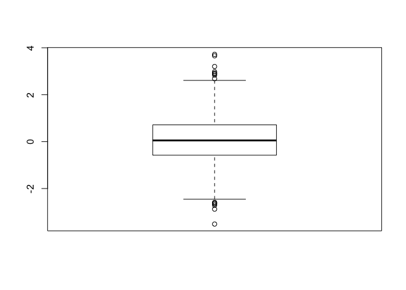

``` r
boxplot (x,horizontal = TRUE)
```

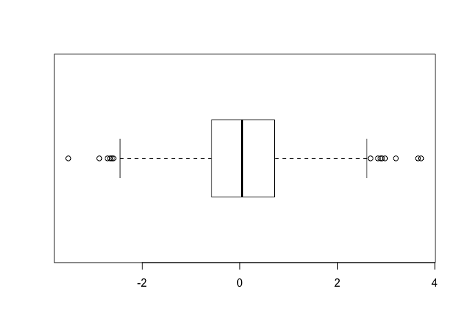

``` r
#hands on session 2
#line plot
read.table("bimm143_05_rstats/weight_chart.txt",header= TRUE)
```

    ##    Age Weight
    ## 1    0    3.6
    ## 2    1    4.4
    ## 3    2    5.2
    ## 4    3    6.0
    ## 5    4    6.6
    ## 6    5    7.2
    ## 7    6    7.8
    ## 8    7    8.4
    ## 9    8    8.8
    ## 10   9    9.2

``` r
weight <- read.table("bimm143_05_rstats/weight_chart.txt",header= TRUE)
plot(weight ,pch=15, cex=1.5, lwd=2, ylim=c(2,10), xlab="Age(months)", ylab="Weight (kg)", main="Baby Weight with Age")
```

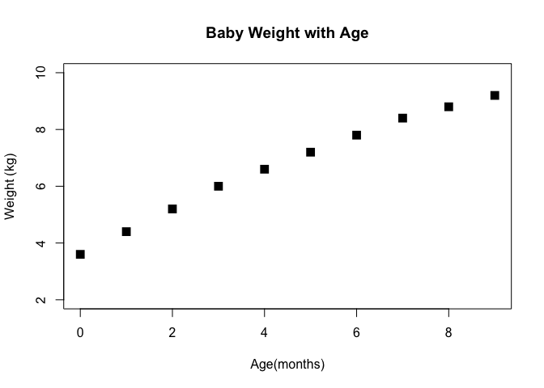

``` r
#View(weight)
plot(weight[,1], weight[,2],typ="o")
```

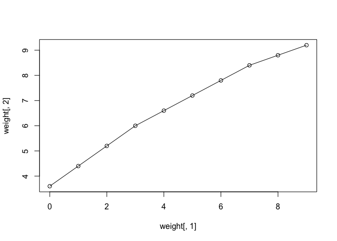

``` r
plot(weight$Age, weight$Weight, typ= "o",pch=15, cex=1.5, lwd=2, ylim=c(2,10), xlab="Age(months)", ylab="Weight (kg)", main="Baby Weight with Age",col=c("blue","red"))
```

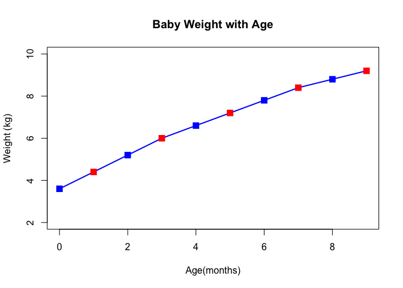

``` r
plot(weight$Age, weight$Weight, typ= "o",pch=15, cex=1:3, lwd=2, ylim=c(2,10), xlab="Age(months)", ylab="Weight (kg)", main="Baby Weight with Age",col=c("blue","red"))
```

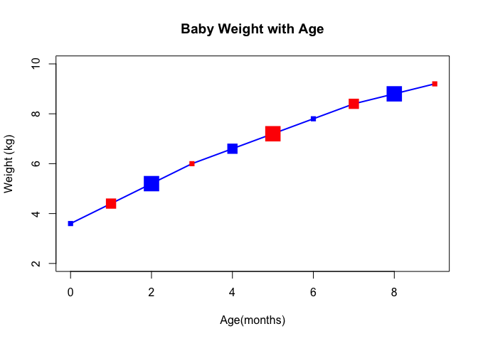

``` r
# barplot
barplot(VADeaths, beside = TRUE)
```

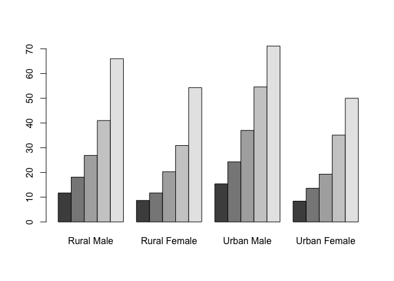

``` r
 # Input our feature count data
mouse <- read.table("bimm143_05_rstats/feature_counts.txt", header= TRUE, sep="\t")
#View(feat)
#?barplot
barplot(mouse$Count, horiz= TRUE, names.arg= mouse$Feature, las=2)

#change margin so we can see labels
# default parameters
par()$mar
```

    ## [1] 5.1 4.1 4.1 2.1

``` r
par(mar= c(5.1, 11.1, 4.1, 2.1))
barplot(mouse$Count, horiz= TRUE, names.arg= mouse$Feature, las=2)
```

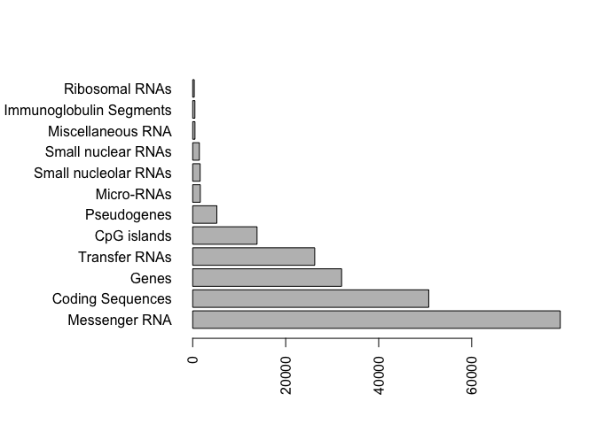

``` r
#colors
barplot(mouse$Count, horiz= TRUE, names.arg= mouse$Feature, las=2, col=cm.colors(5))
```

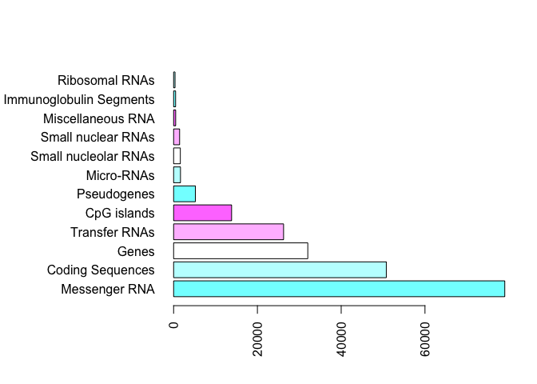

``` r
mf <- read.table("bimm143_05_rstats/male_female_counts.txt", header= TRUE, sep="\t")
#View(mf)
barplot(mf$Count, names.arg= mf$Sample, las=2, col= c("blue1","red2"))
```

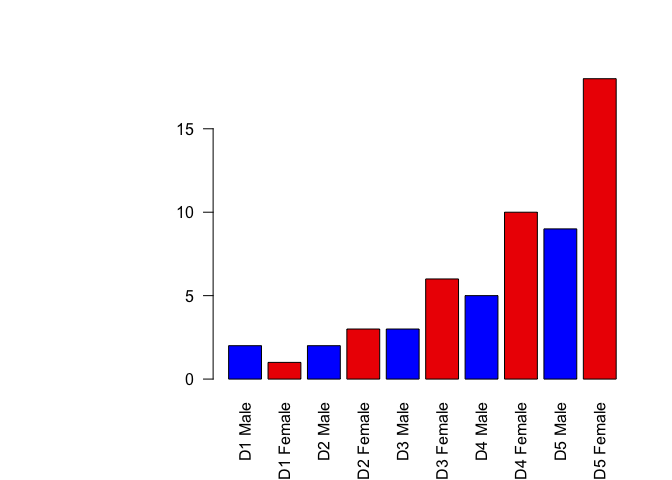

``` r
par(mar= c(3.1, 6.1, 4.1, 2.1))

#expression data
e <- read.table("bimm143_05_rstats/up_down_expression.txt", header= TRUE, sep="\t")
#View(e)

 #how many genes
nrow(e)
```

    ## [1] 5196

``` r
#how many up, down and all around?
table(e$State)
```

    ## 
    ##       down unchanging         up 
    ##         72       4997        127

``` r
plot(e$Condition1,e$Condition2, col=e$State)
```

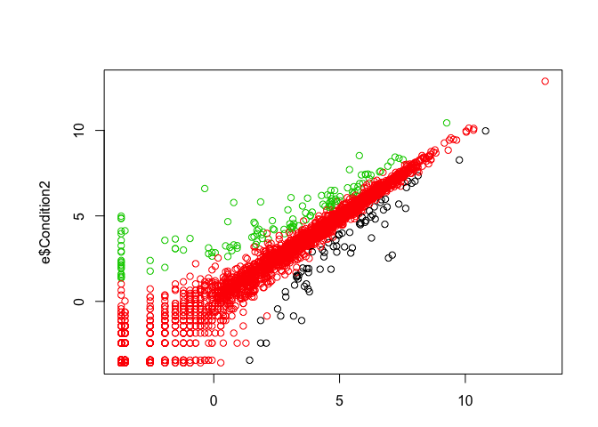

``` r
#palette
palette(c("red","light gray","blue"))
plot(e$Condition1,e$Condition2, col=e$State)
```

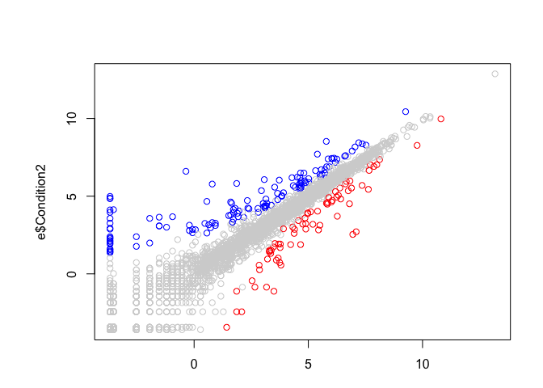
